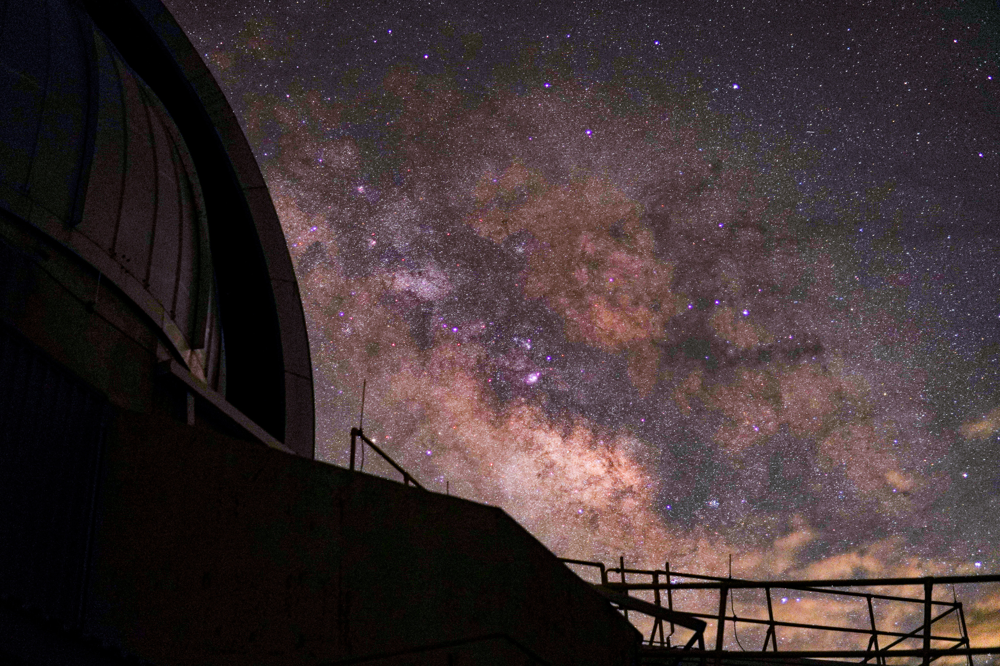

# Fast_Observing_Run

This repo is intended to guide observations using FAST at FLWO, with the heavily help of Michael Calkins and the notes he wrote [document.pdf](document.pdf).

> **All observing procedures, calibration guides, startup/shutdown checklists, and reference material are in the [Wiki](https://github.com/yizedong/Fast_Observing_Run/wiki). Start there.**

*Photo: Yize Dong, FAST 60"/FLWO, April 20 2026*

See all photos: [photography.md](photography.md)